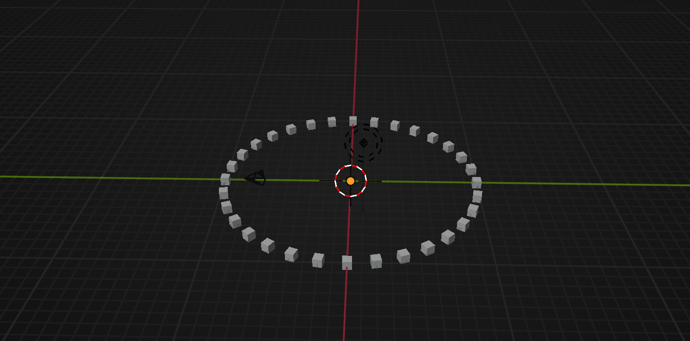

<p></p>

SpaceKit is a blender toolkit built for _The Tauroboros: Animation_ and _Invictus_. It provides a collection of geometry nodes among other utilities that can be used to build unique sci-fi experiences procedurally.

The goal is to create a set of reusable components that will allow you to easily create futuristic renders. There is also a plan to incorporate machine learning to generate content or simulate large groups of entities like spacecrafts.

SpaceKit is currently in **pre-alpha** and highly unstable (i.e. not yet suitable for usage).

## Features

SpaceKit will offer different customizable geometry nodes. If you do not know how to use geometry nodes you should first go through an introductory Blender tutorial. They are not a difficult concept to grasp but you will need to adjust to the node-based workflow.

The current minimum Blender version required is **4.1.1**.

### Custom Themes

The "Space" theme is a dark theme designed to improve performance on slow machines by removing shadows, opacity, and rounded edges from the Blender interface. It was inspired by [kame404/Blender-Themes](https://github.com/kame404/Blender-Themes).

<p></p>

### Circular Array

You can position items in a circular path using the Circular Array node.

<p></p>

### 3D Text Generator

You can generate 3D text with clean topology using the 3D Text Generator node. Use the `string-to-curves` node to connect your own text to the generator node.

<p></p>

### Scripts

The `tools` folder stores some useful Blender scripts.

`triangulate.py`: QtQuick3D needs triangulated models. You can run this script to quickly triangulate all the models stored in the `.glb` files in the current directory. This is a potentially destructive script so you should probably have backups.

## Getting Started

You can download the zip file containing all of the necessary assets from the [releases](https://github.com/sumartian/spacekit/releases). You can then manually install the plugin in Blender and the plugin will then automatically add the asset library once a new `.blend` file is opened. You may need to restart the application after installation for it to work properly.

To clone the repository:

```sh
git clone https://github.com/sumartian/spacekit
cd spacekit
```

## Contributions

You are welcome to contribute to SpaceKit! Feel free to submit your feature requests, pull requests, or any issues and questions you encounter. Please note that you should be using the latest version of all development tools to avoid miscommunication.

## Credits

Most of the nodes were made by watching Blender tutorials on Youtube. Credits to [Johnny Matthews](https://www.youtube.com/c/johnnymatthews), [Blendergrid](https://www.youtube.com/c/blendergrid), and [askNK](https://www.youtube.com/c/asknk). Check out their channels if you want to learn more.

## License

The source code for this project is licensed under [GPLv3](LICENSE.GPLv3) but the generated files and assets are licensed under [Attribution-ShareAlike 4.0 International (CC BY-SA 4.0)](https://creativecommons.org/licenses/by-nc-sa/4.0/). All trademarks are property of their respective owners.
